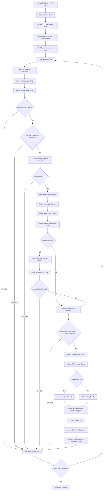

# 🎯 Automated Job Application System

> **Streamline your job search with AI-powered automation**  
> Automatically scrape job postings, match them to your profile, find recruiter emails, and send personalized applications.

---

## ✨ Features

| Feature | Description |
|---------|-------------|
| 🔍 **Smart Job Scraping** | Daily LinkedIn scraping for Machine Learning Engineer positions |
| 🤖 **AI-Powered Matching** | OpenAI O3-Mini scores job compatibility (0-100 scale) |
| 📧 **Dual Email Discovery** | Hunter.io searches HR contacts first, falls back to general emails |
| 📝 **Gmail Draft Generation** | Creates personalized application drafts (no auto-send) |
| 💾 **Comprehensive Tracking** | PostgreSQL database with contact history & response rates |
| 📱 **Telegram Notifications** | Instant alerts for jobs scoring 75+ match rating |
| 🛡️ **Smart Filtering** | Blocks recruitment agencies & security clearance requirements |
| ⏰ **Contact Management** | 30-day cooldown, max 3 contacts per company |

---

## 🚀 Quick Start

### Prerequisites
- Docker & Docker Compose
- N8N instance (included in setup)
- PostgreSQL database (included in setup)

### 1️⃣ Clone & Configure
```bash
git clone https://github.com/your-username/job-automation.git
cd job-automation

# Setup environment variables
cp env.example .env
nano .env  # Add your API keys and credentials
```

### 2️⃣ Launch Services
```bash
# Start all services
docker-compose up -d

# View logs
docker-compose logs -f n8n
```

### 3️⃣ Import Workflows
1. Open N8N at `http://localhost:5678`
2. Import workflow files from the repository
3. Configure credentials in N8N dashboard

---

## 🔑 Required API Keys

| Service | Purpose | Cost | Sign-up Link |
|---------|---------|------|--------------|
| **OpenAI** | Job matching & email generation | ~$0.01 per job | [Get API Key](https://platform.openai.com) |
| **Hunter.io** | Email discovery | 25 free searches/month | [Get API Key](https://hunter.io) |
| **Telegram Bot** | Job notifications | Free | [Create Bot](https://t.me/botfather) |

---

## ⚙️ Configuration

### Environment Variables
Create a `.env` file with your credentials:

```bash
# Database Configuration
PG_DATABASE=job_automation_db
PG_USER=your_username
PG_PASSWORD=your_secure_password
PG_HOST=postgres
PG_PORT=5432

# API Keys
OPENAI_API_KEY=sk-your-openai-key-here
HUNTER_API_KEY=your-hunter-key-here
TELEGRAM_BOT_TOKEN=your-bot-token-here
TELEGRAM_CHAT_ID=your-chat-id-here

# N8N Configuration
N8N_HOST=localhost
N8N_PORT=5678
WEBHOOK_URL=http://localhost:5678/
```

### Resume Customization
Update the resume content in the workflow nodes to match your profile:
- Skills and experience
- Professional summary
- Portfolio links
- Contact information

---

## 📊 Workflow Overview



---

## 🏗️ Database Schema

The system creates and manages these tables:

- **`companies`** - Company information and domains
- **`jobs`** - Job postings and match scores  
- **`email_contacts`** - Recruiter contact information
- **`applications`** - Sent applications and responses

---

## 🛠️ Customization

### Job Filtering & Safety Features
The workflow includes sophisticated filtering to ensure quality and compliance:

**Company Blacklist:**
- Recruitment agencies: `jobright.ai`, `lensa`, `jobs via dice`, `mercor`, `Robert Half`,`micro1`
- Automatically skips these to focus on direct company opportunities

**Security Clearance Detection:**
Automatically filters out jobs requiring:
- US citizenship or permanent residency
- Security clearances (Secret, Top Secret, TS/SCI)
- Government contractor positions
- DOD clearance requirements

**Contact Rate Limiting:**
- Maximum 3 contact attempts per company
- 30-day cooldown period between contacts
- Tracks response rates and contact history
- Prevents spam and maintains professional reputation

### Email Templates & AI Generation
The system uses OpenAI's ChatGPT-4o-Latest to create personalized applications:

**Template Structure:**
- Subject line with job title and key qualification
- Professional opening referencing specific position
- 2-3 relevant qualifications matching job requirements
- Quantifiable achievements from resume
- Professional closing with portfolio links

**Customizable Elements:**
- Tone and writing style preferences
- Key skills and technologies to emphasize
- Industry-specific terminology
- Call-to-action preferences
- Professional links formatting

**Safety Features:**
- Creates Gmail **drafts only** - no automatic sending
- Manual review required before sending
- JSON response validation
- Error handling for AI generation failures

### Notification Settings
Configure Telegram alerts for:
- **Minimum match score threshold**
- **Application confirmations**
- **Daily/weekly summaries**

---

## 📈 Performance & Limits

| Metric | Recommendation |
|--------|---------------|
| **Daily Job Checks** | 1-2 times (avoid rate limiting) |
| **Batch Size** | 10-20 jobs per run |
| **Email Rate** | Max 5 applications per day |
| **Match Threshold** | 75+ for quality applications |

---

## 🔒 Security & Privacy

- ✅ All credentials stored in environment variables
- ✅ Database passwords encrypted
- ✅ API keys never logged or exposed
- ✅ Personal data handled according to platform ToS
- ⚠️ Review generated emails before sending
- ⚠️ Monitor API usage and costs

---

## 🚨 Troubleshooting

<details>
<summary><strong>🔴 Common Issues</strong></summary>

**Database Connection Failed**
```bash
# Check if PostgreSQL is running
docker-compose ps postgres

# View database logs
docker-compose logs postgres
```

**N8N Workflow Errors**
```bash
# Restart N8N service
docker-compose restart n8n

# Check workflow execution logs in N8N dashboard
```

**API Rate Limits**
- Reduce execution frequency
- Check API quotas in service dashboards
- Consider upgrading API plans

**No Jobs Found**
- Verify LinkedIn search URL
- Check job filtering criteria
- Ensure network connectivity

</details>

---

## 📁 Project Structure

```
job-automation/
├── 📄 README.md              # This documentation
├── 🐳 docker-compose.yml     # Service orchestration  
├── ⚙️ env.example            # Environment template
├── 🔄 Final_Working.json     # Main automation workflow
├── 🔄 workflow_with_db.json  # Database-integrated workflow  
├── 🔔 telegram.json          # Telegram notification workflow
├── 🗄️ database_schema.sql    # PostgreSQL database setup
└── 🙈 .gitignore            # Git ignore rules
```

---

## 🤝 Contributing

We welcome contributions! Here's how you can help:

1. **🐛 Report bugs** - Create detailed issue reports
2. **💡 Suggest features** - Share ideas for improvements  
3. **📝 Improve docs** - Help others get started
4. **🔧 Submit PRs** - Fix bugs or add new features

---

## 📜 License

This project is open source and available under the [MIT License](LICENSE).

**⚠️ Disclaimer:** Use responsibly and respect platform terms of service. Monitor your applications and API usage.

---

## 🌟 Star This Repo!

If this project helped streamline your job search, please give it a star ⭐ and share it with others!

---

<div align="center">

**Made with ❤️ by developers, for developers**

[Report Bug](../../issues) • [Request Feature](../../issues) • [Documentation](../../wiki)

</div>
