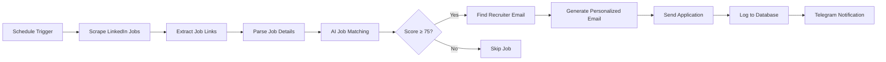

# 🎯 Automated Job Application Systems

> **Streamline your job search with AI-powered automation**  
> Automatically scrape job postings, match them to your profile, find recruiter emails, and send personalized applications.

---

## ✨ Features

| Feature | Description |
|---------|-------------|
| 🔍 **Smart Job Scraping** | Automatically searches LinkedIn for relevant positions |
| 🤖 **AI-Powered Matching** | Uses OpenAI to score job compatibility with your resume |
| 📧 **Email Discovery** | Finds recruiter emails using Hunter.io API |
| 📝 **Personalized Applications** | Generates custom cover letters for each position |
| 💾 **Database Tracking** | Tracks applications, responses, and follow-ups |
| 📱 **Telegram Notifications** | Real-time alerts for high-scoring job matches |

---

## 🚀 Quick Start

### Prerequisites
- Docker & Docker Compose
- N8N instance (included in setup)
- PostgreSQL database (included in setup)

### 1️⃣ Clone & Configure
```bash
git clone https://github.com/your-username/job-automation.git
cd job-automation

# Setup environment variables
cp env.example .env
nano .env  # Add your API keys and credentials
```

### 2️⃣ Launch Services
```bash
# Start all services
docker-compose up -d

# View logs
docker-compose logs -f n8n
```

### 3️⃣ Import Workflows
1. Open N8N at `http://localhost:5678`
2. Import workflow files from the repository
3. Configure credentials in N8N dashboard

---

## 🔑 Required API Keys

| Service | Purpose | Cost | Sign-up Link |
|---------|---------|------|--------------|
| **OpenAI** | Job matching & email generation | ~$0.01 per job | [Get API Key](https://platform.openai.com) |
| **Hunter.io** | Email discovery | 25 free searches/month | [Get API Key](https://hunter.io) |
| **Telegram Bot** | Job notifications | Free | [Create Bot](https://t.me/botfather) |

---

## ⚙️ Configuration

### Environment Variables
Create a `.env` file with your credentials:

```bash
# Database Configuration
PG_DATABASE=job_automation_db
PG_USER=your_username
PG_PASSWORD=your_secure_password
PG_HOST=postgres
PG_PORT=5432

# API Keys
OPENAI_API_KEY=sk-your-openai-key-here
HUNTER_API_KEY=your-hunter-key-here
TELEGRAM_BOT_TOKEN=your-bot-token-here
TELEGRAM_CHAT_ID=your-chat-id-here

# N8N Configuration
N8N_HOST=localhost
N8N_PORT=5678
WEBHOOK_URL=http://localhost:5678/
```

### Resume Customization
Update the resume content in the workflow nodes to match your profile:
- Skills and experience
- Professional summary
- Portfolio links
- Contact information

---

## 📊 Workflow Overview



---

## 🏗️ Database Schema

The system creates and manages these tables:

- **`companies`** - Company information and domains
- **`jobs`** - Job postings and match scores  
- **`email_contacts`** - Recruiter contact information
- **`applications`** - Sent applications and responses

---

## 🛠️ Customization

### Job Filtering
Modify the filtering criteria in the workflow:
- **Location preferences**
- **Company blacklist** (recruitment agencies)
- **Required keywords**
- **Security clearance requirements**

### Email Templates  
Customize the AI prompt for generating cover letters:
- **Tone and style**
- **Key skills to highlight**
- **Call-to-action preferences**

### Notification Settings
Configure Telegram alerts for:
- **Minimum match score threshold**
- **Application confirmations**
- **Daily/weekly summaries**

---

## 📈 Performance & Limits

| Metric | Recommendation |
|--------|---------------|
| **Daily Job Checks** | 1-2 times (avoid rate limiting) |
| **Batch Size** | 10-20 jobs per run |
| **Email Rate** | Max 5 applications per day |
| **Match Threshold** | 75+ for quality applications |

---

## 🔒 Security & Privacy

- ✅ All credentials stored in environment variables
- ✅ Database passwords encrypted
- ✅ API keys never logged or exposed
- ✅ Personal data handled according to platform ToS
- ⚠️ Review generated emails before sending
- ⚠️ Monitor API usage and costs

---

## 🚨 Troubleshooting

<details>
<summary><strong>🔴 Common Issues</strong></summary>

**Database Connection Failed**
```bash
# Check if PostgreSQL is running
docker-compose ps postgres

# View database logs
docker-compose logs postgres
```

**N8N Workflow Errors**
```bash
# Restart N8N service
docker-compose restart n8n

# Check workflow execution logs in N8N dashboard
```

**API Rate Limits**
- Reduce execution frequency
- Check API quotas in service dashboards
- Consider upgrading API plans

**No Jobs Found**
- Verify LinkedIn search URL
- Check job filtering criteria
- Ensure network connectivity

</details>

---

## 📁 Project Structure

```
job-automation/
├── 📄 README.md              # This documentation
├── 🐳 docker-compose.yml     # Service orchestration  
├── ⚙️ .env.example           # Environment template
├── 🔄 workflows/
│   ├── Final_Working.json    # Main automation workflow
│   ├── workflow_with_db.json # Database integration
│   └── telegram.json         # Notification workflow
├── 🗄️ database/
│   └── schema.sql            # Database setup script
└── 📚 docs/                  # Additional documentation
```

---

## 🤝 Contributing

We welcome contributions! Here's how you can help:

1. **🐛 Report bugs** - Create detailed issue reports
2. **💡 Suggest features** - Share ideas for improvements  
3. **📝 Improve docs** - Help others get started
4. **🔧 Submit PRs** - Fix bugs or add new features

---

## 📜 License

This project is open source and available under the [MIT License](LICENSE).

**⚠️ Disclaimer:** Use responsibly and respect platform terms of service. Monitor your applications and API usage.

---

## 🌟 Star This Repo!

If this project helped streamline your job search, please give it a star ⭐ and share it with others!

---

<div align="center">

**Made with ❤️ by developers, for developers**

[Report Bug](../../issues) • [Request Feature](../../issues) • [Documentation](../../wiki)

</div>
